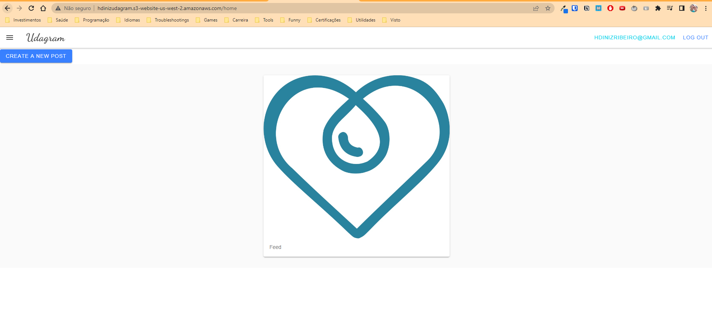

# Udagram

This application is a custom app that creates a feed with images similar to instagram, where the user can register and login to the system create new Posts to the feed uploading image and also check all posts in its own feed.

Link to application:
http://hdinizudagram.s3-website-us-west-2.amazonaws.com/

## Project Setup

Provision the necessary AWS services needed for running the application:

1. In AWS, provision a publicly available RDS database running Postgres. <Place holder for link to classroom article>
1. In AWS, provision a s3 bucket for hosting the uploaded files. <Place holder for tlink to classroom article>
1. Export the ENV variables needed or use a package like [dotnev](https://www.npmjs.com/package/dotenv)/.
1. From the root of the repo, navigate udagram-api folder `cd starter/udagram-api` to install the node_modules `npm install`. After installation is done start the api in dev mode with `npm run dev`.
1. Without closing the terminal in step 1, navigate to the udagram-frontend `cd starter/udagram-frontend` to intall the node_modules `npm install`. After installation is done start the api in dev mode with `npm run start`.

## Contributing

This project is closed for contribution as it is intended to practice the what was learned in the final module of FullStack Javascript Developer udacity course.