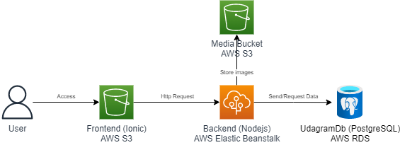
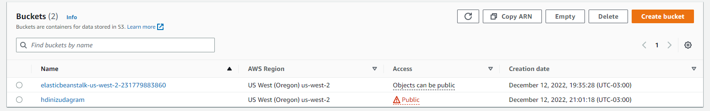
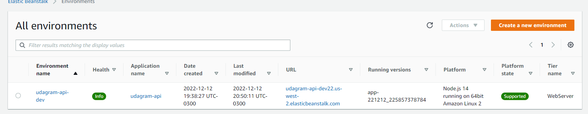
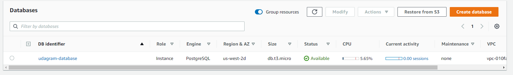

# Infrastructure description

## Components

**Frontend:** The frontend is build on IONIC with Angular Framework, it's hosted as a static website on AWS S3

**Backend:** The backend is built on NodeJs, it's hosted on AWS Elastic BeanStalk

**UdagramDB:**: The database of the application, hosted on AWS RDS

**Media Bucket:**: Bucket to store feed images

## Screenshots

### Bucket

### Elastic beanstalk

### AWS RDS

