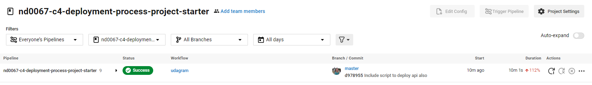
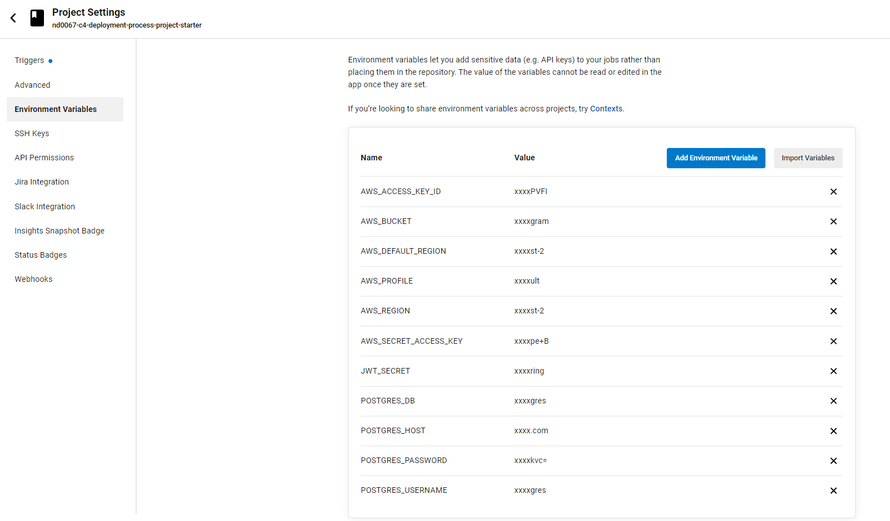

# Pipeline Description

## Phases

### Build

This phase is dedicated to install all dependencies, bundle and build a package of the application

**Steps:**
 
1. Install node: Step to install the necessary node and npm version

2. Checkout Code: Download the newest version of the code from git repository

3. Install Frontend Dependencies: Install all dependencies to build frontend, including angular, ionic, etc...

4. Install API Dependencies: Install all api dependencies, including express, jwt, etc ...

5. Frontend Build: Compile typescript and build the frontend bundle

6. API Build: Compile typescript and create the API bundle

### Deploy

This phase is dedicated to deploy the application to S3 and Elastic Beanstalk (check infrastructure doc [here](Infrastructure_description.md))

**Steps:**

1. Approve Deploy: In this step the pipeline stops waiting for a manual approve.

2. API Deploy: Deploy the api to Elastic Beanstalk instance.

3. Frontend Deploy: Deploy the Frontend to AWS S3

## Screenshots

### Successful execution

### Environment variables

